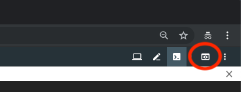

## Creating and running containers

We will be using cloud shell that has docker already installed.

### Exercise 1: Creating a custom image.

1. Start container using `ubuntu` image and attach to it.
    ```
    docker run -it ubuntu bash
    ```
    This command runs `bash` inside the container.

1. Install `nginx` inside the container.
    ```
    apt-get update
    apt-get install -y nginx
    ```

1. Cloud shell is integrated with tmux, if you want to learn a little more you can run `ctrl-b ?`, but for next exercise you can use `ctrl-b %` to split terminal and `ctrl-b ;` to move from one window pane to the other.  

1. In a separate terminal window or split pane inside of tmux list all running containers. Copy `CONTAINER ID` field.
    ```
    docker ps
    ```

1. Commit your changes to a new image. (Replace <conainer-id> with actual container id)
    ```
    docker commit <container-id> my-image
    ```

1. List all images and make sure that `my-image` is on the list.
    ```
    docker images
    ```

1. Exit from the running container.
    ```
    exit
    ```

### Exercise 2: Exposing ports.

1. Run previously created image.
    ```
    docker run -it -p 8080:80 my-image nginx -g 'daemon off;'
    ```
    The arguments of this command have the following meaning:
    * `-it` - attach to the container.
    * `-p 8080:80` - map port `80` in the container to port `8080` on the host system.
    * `my-image` - run image `my-image`
    * `nginx -g 'daemon off;'` - start nginx in foreground mode. Without `daemon off` parameter nginx will start in a background process, and the command finishes immediately. After start command finishes, container will be killed.
    * For further reference to this command and ones we will be running next you can look here, [Docker run](https://docs.docker.com/engine/reference/run/).

1. Use cloud shell web preview, it is at top right of cloud shell window, or you can use split window like we did above and run `curl http://localhost:8080`. You should now see nginx page.

    

1. Stop docker process, `ctrl-c`.  

### Exercise 3: Mapping volumes.

1. Run the following command.
    ```
    docker run -it -p 8080:80 -v /tmp/html:/var/www/html my-image nginx -g 'daemon off;'
    ```

    Here we are mapping `/tmp/html` folder on the host machine to the `/var/www/html` folder inside the container.

1. Save the following file as `index.html` inside `/tmp/html` folder on your local machine.
    ```
    sudo chmod g+w /tmp/html; sudo chgrp $(id -g) /tmp/html
    ```

    ```
    cat > /tmp/html/index.html <<EOF
    <!DOCTYPE html>
    <html>
    <body>

    <h1>My First Heading</h1>

    <p>My first paragraph.</p>

    </body>
    </html>
    EOF
    ```

1. Use cloud shell web preview, it is at top right of cloud shell window, or you can use split window like we did above and run `curl http://localhost:8080`. You should now see nginx page.

### Exercise 4 (Optional): Dockerfiles.

Docker can build images automatically by reading instructions from a script. It is generally best practice to use Dockerfiles to easily update, maintain, modify and recreate containers, [Dockerfile Reference](https://docs.docker.com/engine/reference/builder/).

In this exercise, we will create a Docker image with Nginx and PHP-FPM 7 using an Ubuntu 16.04 docker image. Additionally, we need Supervisord, so we can start Nginx and PHP-FPM 7 both in one command.

1. Save the following file as `Dockerfile` inside `/tmp/docker-exercise4`
    ```
    mkdir /tmp/docker-exercise4
    ```

    ```
    cat > /tmp/docker-exercise4/Dockerfile <<EOF  
    #Download base image ubuntu 16.04
    FROM ubuntu:16.04

    # Set the author
    MAINTAINER Firstname Lastname <firstname.lastname@company.com>

    # Set a label
    LABEL com.example.version="1.0.0"

    # Update Software repository
    RUN apt-get update

    # Install nginx, php-fpm and supervisord from ubuntu repository
    RUN apt-get install -y nginx php7.0-fpm supervisor && \
        rm -rf /var/lib/apt/lists/*

    # Define the ENV variable
    ENV nginx_vhost /etc/nginx/sites-available/default
    ENV php_conf /etc/php/7.0/fpm/php.ini
    ENV nginx_conf /etc/nginx/nginx.conf
    ENV supervisor_conf /etc/supervisor/supervisord.conf

    # Enable php-fpm on nginx virtualhost configuration
    COPY default \${nginx_vhost}
    RUN sed -i -e 's/;cgi.fix_pathinfo=1/cgi.fix_pathinfo=0/g' \${php_conf} && \
        echo "\ndaemon off;" >> \${nginx_conf}

    # Copy supervisor configuration
    COPY supervisord.conf \${supervisor_conf}

    RUN mkdir -p /run/php && \
        chown -R www-data:www-data /var/www/html && \
        chown -R www-data:www-data /run/php

    # Volume configuration
    VOLUME ["/etc/nginx/sites-enabled", "/etc/nginx/certs", "/etc/nginx/conf.d", "/var/log/nginx", "/var/www/html"]

    # Configure Services and Port
    COPY start.sh /start.sh
    CMD ["./start.sh"]

    EXPOSE 80 443
    EOF
    ```

1. Save the following file as `default` inside `/tmp/docker-exercise4`, this is the nginx virtual host file
    ```
    cat > /tmp/docker-exercise4/default <<EOF
    server {
        listen 80 default_server;
        listen [::]:80 default_server;

        root /var/www/html;
        index index.html index.htm index.nginx-debian.html;

        server_name _;

        location / {
            try_files $uri $uri/ =404;
        }

        location ~ \.php$ {
            include snippets/fastcgi-php.conf;
            fastcgi_pass unix:/run/php/php7.0-fpm.sock;
        }
    }
    EOF
    ```

1. Save the following file as `supervisord.conf` inside `/tmp/docker-exercise4`, this is the supervisord configuration file
    ```
    cat > /tmp/docker-exercise4/supervisord.conf <<EOF
    [unix_http_server]
    file=/dev/shm/supervisor.sock   ; (the path to the socket file)

    [supervisord]
    logfile=/var/log/supervisord.log ; (main log file;default $CWD/supervisord.log)
    logfile_maxbytes=50MB        ; (max main logfile bytes b4 rotation;default 50MB)
    logfile_backups=10           ; (num of main logfile rotation backups;default 10)
    loglevel=info                ; (log level;default info; others: debug,warn,trace)
    pidfile=/tmp/supervisord.pid ; (supervisord pidfile;default supervisord.pid)
    nodaemon=false               ; (start in foreground if true;default false)
    minfds=1024                  ; (min. avail startup file descriptors;default 1024)
    minprocs=200                 ; (min. avail process descriptors;default 200)
    user=root             ;

    [rpcinterface:supervisor]
    supervisor.rpcinterface_factory = supervisor.rpcinterface:make_main_rpcinterface

    [supervisorctl]
    serverurl=unix:///dev/shm/supervisor.sock ; use a unix:// URL  for a unix socket

    [include]
    files = /etc/supervisor/conf.d/*.conf


    [program:php-fpm7.0]
    command=/usr/sbin/php-fpm7.0 -F
    numprocs=1
    autostart=true
    autorestart=true

    [program:nginx]
    command=/usr/sbin/nginx
    numprocs=1
    autostart=true
    autorestart=true
    EOF
    ```

1. Save the following file as `start.sh` inside `/tmp/docker-exercise4`, this is the script that is run when the container is created from the image
    ```
    cat > /tmp/docker-exercise4/start.sh <<EOF
    #!/bin/sh
    /usr/bin/supervisord -n -c /etc/supervisor/supervisord.conf
    EOF
    ```

1. Make the startup script executable
    ```
    chmod +x /tmp/docker-exercise4/start.sh
    ```

1. Build and verify the custom docker image was created
    ```
    cd /tmp/docker-exercise4/
    docker build -t custom_nginx_image .
    docker images
    ```

1. Save the following file as `info.php` inside `/tmp/html` folder on your local machine.
    ```
    cat > /tmp/html/info.php <<EOF
    <?php phpinfo(); ?>
    EOF
    ```

1. Run the docker image
    ```
    docker run -it -p 3000:80 -v /tmp/html:/var/www/html --name test custom_nginx_image
    ```

1. Web preview will not work for this because of some redirects, so run `curl http://localhost:3000/info.php`. This should verify that nginx and php is working.

When creating Dockerfiles there are [several best practices](https://docs.docker.com/v17.09/engine/userguide/eng-image/dockerfile_best-practices/) which should always be followed.

### Exercise 5 (Optional): Docker networking.

1. Find the docker command to list the networks (Hint: Use `docker -h`)
1. Inspect the bridge and host networks of docker
1. Create a new isolated bridge network called `isolated_bridge_network`
1. Inspect both bridge networks, what is the difference between the two?
1. Adopt the previous nginx example to run use the new isolated bridge network
1. Go inside running container (`docker exec -it <container-id> bash`) and find its IP (`ip addr show`)
1. Inspect the docker container (`docker inspect <container-id>`) and find its IP
1. Make sure you understand the difference between [host](https://docs.docker.com/network/host/) and default [bridge](https://docs.docker.com/network/bridge/) networks.

---

Next: [Kubernetes Operations (kops)](kops.md)
